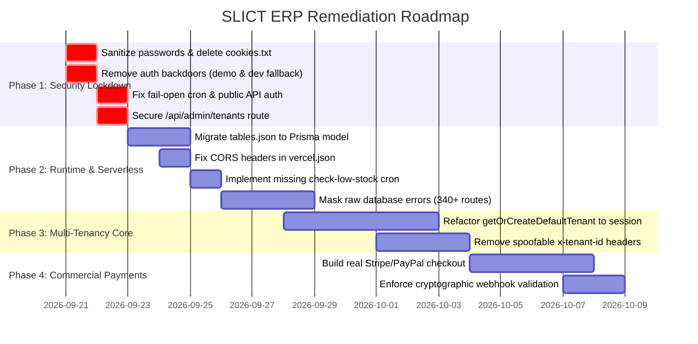

# SLICT ERP — Master Project Management State

> Summary for agents. The full record (findings, fixes, research, decisions, operations) is the
> private repository `umairmsm/slict-pm`, moving to `slict-lk` once Mr. Mubasshir accepts it.

Canonical PM contract per workspace agent conventions. This is the single canonical reference file for all AI agents (Claude Code & Antigravity) and human engineers working on the **SLICT ERP** ecosystem.

---

## 📍 System Health & Current Status

* **Repository State:** 🔒 **PRIVATE** (Changed from Public on 2026-09-20).
* **Primary Branch:** `ERP.SLICT.LK` (Default).
* **Current Health:** **AMBER** (Codebase functional but gated by security and multi-tenancy remediation).
* **Target Audience:** Multi-tenant enterprise clients across automotive export, spare parts, accounting, hospitality, healthcare, and retail POS.

---

## 📜 Timeline & Context Baseline

### ⏪ WHERE WE WERE (QA Report Baseline — 2026-08-05)
* Initial QA test report recorded 75 passed / 29 failed (72.1% pass rate).
* 29 failures were attributed to 19 missing API endpoints.
* Assumed production-ready based on local HTTP 200 checks.

### 📍 WHERE WE ARE NOW (Forensic Second Opinion Audit — 2026-09-21)
* Identified that commit `b13282d` added the 19 missing routes without authentication or schema validation.
* Identified 7 Critical (P0) security vulnerabilities:
  1. Plaintext SuperAdmin credentials (`mubasshir@slict.lk` / `[REDACTED — rotated credential]`) in `create-superadmin.ts` and `qa-test-suite.mjs`.
  2. Database password (`admin:[REDACTED — rotated credential]`) in `docker-compose.yml`.
  3. Active JWE session tokens in `cookies.txt`.
  4. Demo account backdoor in `src/lib/auth-options.ts`.
  5. Fail-open authorization in `src/app/api/cron/*` and `src/app/api/public/export/*`.
  6. AI chatbot SQL injection vector via unparameterized `$queryRawUnsafe` with missing `UNION` filtering.
  7. Client call stack leak in `src/app/api/crm/opportunities/route.ts`.
* Identified pervasive multi-tenancy leak: 450+ API route calls use `getOrCreateDefaultTenant()`, causing cross-tenant data contamination.
* Identified serverless deployment blocker: `fs.writeFileSync` in `src/app/api/restaurant/tables/route.ts`.
* Identified payment gap: Marketplace checkout runs a fake `setTimeout` (MockStripe) without real gateway execution.

---

## 🎯 Phased Remediation Roadmap

---

## 👥 Dual-Agent Sprints & Task Ownership

| Task | Owner Agent | Branch | Status |
|---|---|---|---|
| Remove `cookies.txt`, `s`, and shell spills | Antigravity | `ag/phase1-hygiene` | ⏳ Ready |
| Sanitize passwords in `create-superadmin.ts` & `docker-compose.yml` | Claude Code | `claude/sanitize-secrets` | ⏳ Ready |
| Remove demo account bypass in `auth-options.ts` | Claude Code | `claude/auth-hardening` | ⏳ Ready |
| Fix fail-open check in `api/cron/*` & `export/*` | Claude Code | `claude/auth-hardening` | ⏳ Ready |
| Protect `api/admin/tenants` behind `isSuperAdmin` | Claude Code | `claude/auth-hardening` | ⏳ Ready |
| Migrate `restaurant/tables` from JSON to Prisma | Claude Code | `claude/serverless-compat` | 📋 Queued |
| Fix CORS conflict in `vercel.json` | Antigravity | `ag/vercel-config` | 📋 Queued |
| Refactor 450+ APIs from `getOrCreateDefaultTenant` to session | Joint / Paired | `fix/multi-tenancy-core` | 📋 Queued |
| Real Stripe / PayPal checkout & webhook signature verification | Joint / Paired | `feat/payment-gateway` | 📋 Queued |
| PR Reviews, Git Verification & Releases | Antigravity | Review Gate | 🛡️ Active |

---

## 📋 Conventions & Rules

1. **One Fact, One Home:** High-level sprint state stays in this file (`PROJECT.md`). Granular line-level checklists stay in `docs/AUDIT_TASK_TRACKER.md`.
2. **Branching:** Claude Code works on `claude/<feature>`, Antigravity works on `ag/<feature>`.
3. **Approval Gate:** Any destructive migration, credential reset, or production deployment requires human approval from Umair / Mubasshir.
